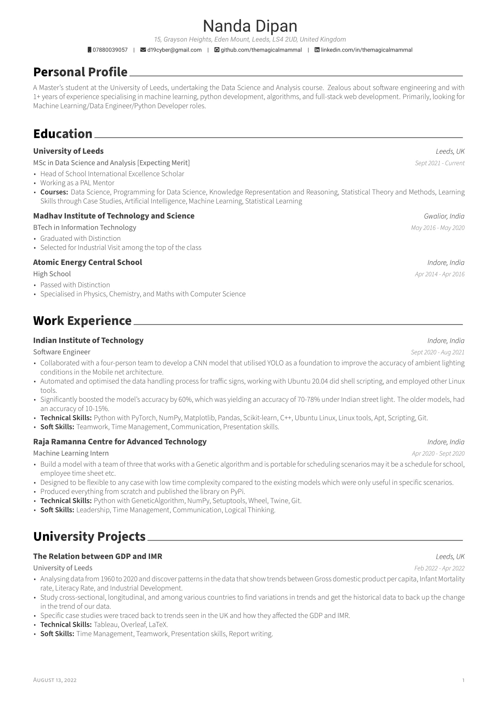
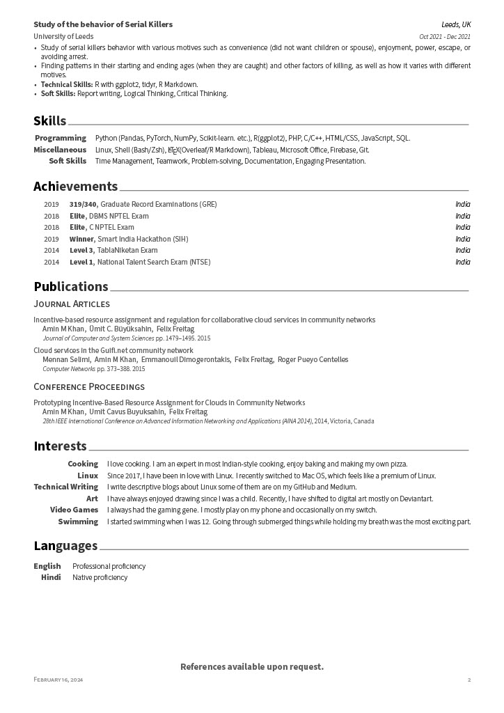

# $\color[RGB]{250,100,122} Information$

This resume template has been developed with the guidance of coaches at the University of Leeds, ensuring it aligns with the standards set forth by the Russell Group in the United Kingdom.

# $\color[RGB]{250,100,122} Preview$

| |  |
|:-------------------------:|:-------------------------:|

# $\color[RGB]{250,100,122} Contribute$
This project is open to contributions of all kinds. Fork the repo, make your changes, and submit a pull request. Every contribution counts!

Thanks for considering contributing to this project. Let's make it awesome together!

# $\color[RGB]{0,200,0} Óverleaf$
You can edit this [here](https://www.overleaf.com/latex/templates/russelresume/zqnypvvjsfvq).

# $\color[RGB]{250,100,122} References$

# $\color[RGB]{250,100,122} Credits$

