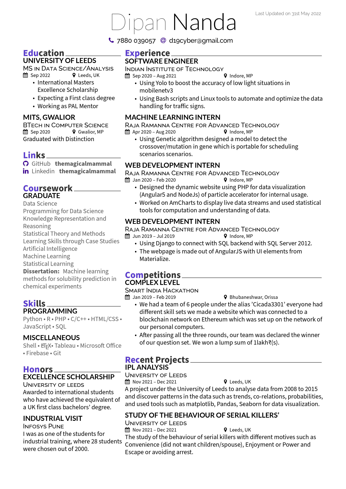

  
  
    
  MagicalCV is a LaTeX template for a resume, inspired by many existing resumes'. It is made to be beautiful & also is compact to fit in as much data as you can.
  
    
  
  
    
  Do you want to contribute to this? Please do so. I am happy to add changes, improvements, and bug fixes to this repo.
  
    
  [Deedy-Resume](https://github.com/deedy/Deedy-Resume) • [Awesome-CV](https://github.com/posquit0/Awesome-CV) • [AltaCV](https://github.com/liantze/AltaCV)
  
    
  [Debarghya Das](https://github.com/deedy) • [Byungjin Park](https://github.com/posquit0) • [liantze](https://github.com/liantze)
  

